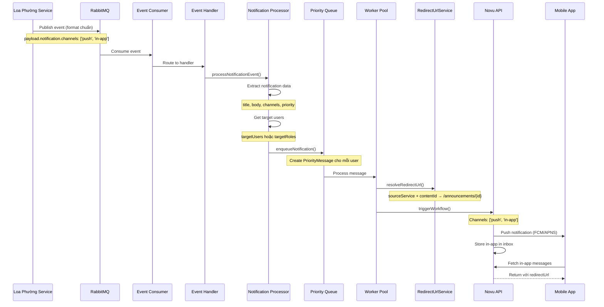

# Notification Event Standard - Format Chuẩn cho Tất Cả Services

## ⚠️ DEPRECATED - Format Cũ Đã Bị Loại Bỏ

**File này chứa format cũ đã bị deprecated. Vui lòng sử dụng format mới:**

👉 **[Notification Event Format V2](./notification-event-format-v2.md)** - Format chuẩn hiện tại

---

## Tổng quan (DEPRECATED)

> ⚠️ **LƯU Ý**: Format trong file này đã bị loại bỏ. Tất cả services phải sử dụng format mới trong `notification-event-format-v2.md`

Tất cả các services (loa phường, task, payment, booking, etc.) cần gửi events theo **format chuẩn** này để hệ thống notification có thể xử lý và gửi **cả push và in-app notifications**.

## ⭐ Câu Trả Lời Ngắn Gọn

**Có, format body chung cho push và in-app là giống nhau!** 

Tất cả services chỉ cần gửi **1 event** với format chuẩn, hệ thống sẽ tự động:
- ✅ Gửi push notification nếu `channels` có `'push'`
- ✅ Lưu in-app notification vào Novu inbox nếu `channels` có `'in-app'`
- ✅ Tự động resolve redirect URL từ `sourceService` + `contentId`

## Format Event Chuẩn qua RabbitMQ

### Cấu trúc Event

```json
{
  "eventId": "event-cuid-123",
  "eventType": "{service}.{EventName}",
  "aggregateId": "aggregate-id",
  "aggregateType": "Announcement",
  "timestamp": "2024-11-05T16:00:00Z",
  "correlationId": "correlation-id-123",
  "payload": {
    // Notification data
    "notification": {
      "title": "Tiêu đề thông báo",
      "body": "Nội dung thông báo",
      "type": "announcement",
      "priority": "normal",
      "channels": ["push", "in-app"],
      "targetUsers": ["user-123", "user-456"],
      "targetRoles": ["RESIDENT", "ADMIN"]
    },
    // Service-specific data
    "sourceService": "loaphuong",
    "contentId": "announcement-123",
    "contentType": "announcement",
    "redirectUrl": "/announcements/announcement-123", // Optional - auto-resolve if not provided
    "data": {
      // Additional metadata
      "announcementId": "announcement-123",
      "category": "general"
    }
  },
  "metadata": {
    "source": "loaphuong-service",
    "version": "1.0.0"
  }
}
```

## Format Notification Data (trong payload.notification)

### Required Fields

```typescript
{
  title: string;           // Tiêu đề thông báo (max 200 chars)
  body: string;            // Nội dung thông báo (max 1000 chars)
  type: string;            // 'announcement' | 'payment' | 'booking' | 'emergency'
  priority: string;        // 'urgent' | 'high' | 'normal' | 'low'
  channels: string[];      // ['push', 'in-app'] hoặc ['push'] hoặc ['in-app']
}
```

### Optional Fields

```typescript
{
  targetUsers?: string[];      // Danh sách userId cụ thể
  targetRoles?: string[];      // Danh sách roles (RESIDENT, ADMIN, etc.)
  scheduledAt?: string;        // ISO date string - nếu muốn schedule
  redirectUrl?: string;        // Custom redirect URL (override auto-resolve)
  data?: Record<string, any>;  // Additional metadata
}
```

## Format cho Loa Phường Service

### Ví dụ: Announcement Created Event

```json
{
  "eventId": "event-announce-123",
  "eventType": "loaphuong.AnnouncementCreated",
  "aggregateId": "announcement-123",
  "aggregateType": "Announcement",
  "timestamp": "2024-11-05T16:00:00Z",
  "correlationId": "corr-123",
  "payload": {
    "notification": {
      "title": "Thông báo từ loa phường",
      "body": "Có thông báo mới về quy định chung cư",
      "type": "announcement",
      "priority": "normal",
      "channels": ["push", "in-app"],
      "targetRoles": ["RESIDENT"]
    },
    "sourceService": "loaphuong",
    "contentId": "announcement-123",
    "contentType": "announcement",
    "data": {
      "announcementId": "announcement-123",
      "category": "general",
      "buildingId": "building-A"
    }
  }
}
```

**Kết quả:**
- ✅ Push notification được gửi
- ✅ In-app notification được lưu trong Novu inbox
- ✅ Redirect URL tự động: `/announcements/announcement-123`

## Format cho Task Service

### Ví dụ: Task Assigned Event

```json
{
  "eventId": "event-task-456",
  "eventType": "task.TaskAssigned",
  "aggregateId": "task-456",
  "aggregateType": "Task",
  "timestamp": "2024-11-05T16:00:00Z",
  "payload": {
    "notification": {
      "title": "Bạn có task mới",
      "body": "Task 'Vệ sinh hành lang' đã được giao cho bạn",
      "type": "booking",
      "priority": "high",
      "channels": ["push", "in-app"],
      "targetUsers": ["user-789"]
    },
    "sourceService": "task",
    "contentId": "task-456",
    "contentType": "task",
    "data": {
      "taskId": "task-456",
      "assigneeId": "user-789",
      "dueDate": "2024-11-06T10:00:00Z"
    }
  }
}
```

**Kết quả:**
- ✅ Redirect URL tự động: `/tasks/task-456`

## Format cho Payment Service

### Ví dụ: Payment Completed Event

```json
{
  "eventId": "event-payment-789",
  "eventType": "payment.PaymentCompleted",
  "aggregateId": "payment-789",
  "aggregateType": "Payment",
  "timestamp": "2024-11-05T16:00:00Z",
  "payload": {
    "notification": {
      "title": "Thanh toán thành công",
      "body": "Bạn đã thanh toán thành công 2,000,000 VNĐ",
      "type": "payment",
      "priority": "normal",
      "channels": ["push", "in-app"],
      "targetUsers": ["user-123"]
    },
    "sourceService": "payment",
    "contentId": "payment-789",
    "contentType": "payment",
    "data": {
      "paymentId": "payment-789",
      "amount": 2000000,
      "currency": "VND"
    }
  }
}
```

**Kết quả:**
- ✅ Redirect URL tự động: `/payments/payment-789`

## Cơ chế Trigger - Luồng Xử Lý Chi Tiết

### Tổng Quan Luồng



### Bước 1: Service gửi Event qua RabbitMQ

**Format chuẩn - chỉ cần gửi 1 event:**

```typescript
// Trong loa phường service (hoặc bất kỳ service nào)
const event = {
  eventId: generateCuid(),
  eventType: 'loaphuong.AnnouncementCreated',
  aggregateId: announcement.id,
  aggregateType: 'Announcement',
  timestamp: new Date().toISOString(),
  correlationId: generateCorrelationId(),
  payload: {
    // ⭐ Notification data - format chung cho push và in-app
    notification: {
      title: 'Thông báo mới',
      body: 'Nội dung thông báo...',
      type: 'announcement',
      priority: 'normal',
      channels: ['push', 'in-app'], // ⭐ Quan trọng: chỉ định channels
      targetRoles: ['RESIDENT'],     // Hoặc targetUsers: ['user-123']
    },
    // ⭐ Service metadata - để resolve redirect URL
    sourceService: 'loaphuong',      // ⭐ Quan trọng: để map redirect pattern
    contentId: announcement.id,      // ⭐ Quan trọng: để tạo redirect URL
    contentType: 'announcement',
    data: {
      announcementId: announcement.id,
      category: 'general',
    }
  },
  metadata: {
    source: 'loaphuong-service',
    version: '1.0.0'
  }
};

// Publish to RabbitMQ
await rabbitMQService.publish(
  'notifications.exchange',
  'loaphuong.AnnouncementCreated',
  event
);
```

### Bước 2: Notification Service nhận Event

```
RabbitMQ Exchange: notifications.exchange
Routing Key: loaphuong.AnnouncementCreated
    ↓
Event Consumer (RabbitMQConsumerService)
    ↓
Event Handler (BaseEventHandler)
    ↓
Notification Processing Service
```

### Bước 3: Chuyển đổi thành NotificationAggregate

```typescript
// Trong NotificationProcessingService.processNotificationEvent()
const params: ProcessNotificationEventParams = {
  title: event.payload.notification.title,
  body: event.payload.notification.body,
  type: event.payload.notification.type,
  priority: event.payload.notification.priority,
  channels: event.payload.notification.channels, // ['push', 'in-app']
  targetRoles: event.payload.notification.targetRoles,
  targetUsers: event.payload.notification.targetUsers,
  data: {
    ...event.payload.data,
    sourceService: event.payload.sourceService,  // ⭐ Pass through
    contentId: event.payload.contentId,          // ⭐ Pass through
    contentType: event.payload.contentType,
  }
};

const notification = NotificationFactory.fromEventData(params);
```

### Bước 4: Enqueue vào Priority Queue

```typescript
// Trong queueNotificationsForProcessing()
for (const userId of userIds) {
  const priorityMessage: PriorityMessage = {
    id: notification.id,
    userId: userId,
    type: notification.type.getValue(),
    title: notification.title,
    body: notification.body,
    priority: notification.priority.getValue(),
    data: {
      channels: ['push', 'in-app'],  // ⭐ Từ notification
      sourceService: 'loaphuong',     // ⭐ Từ event payload
      contentId: 'announcement-123',  // ⭐ Từ event payload
      contentType: 'announcement',
      data: { /* additional data */ }
    }
  };
  
  await priorityQueueService.enqueueNotification(priorityMessage);
}
```

### Bước 5: Worker xử lý và Resolve Redirect URL

```typescript
// Trong PriorityQueueService.handleNotification()
const channels = message.data?.channels || ['push']; // ['push', 'in-app']

// ⭐ Tự động resolve redirect URL
const redirectUrl = this.redirectUrlService.resolveRedirectUrl(
  message.data?.sourceService,  // 'loaphuong'
  message.data?.contentId,      // 'announcement-123'
  undefined,
  message.data?.contentType      // 'announcement'
);
// Kết quả: '/announcements/announcement-123'
```

### Bước 6: Trigger Novu Workflow

```typescript
// Trong PriorityQueueService.handleNotification()
await this.novuClient.triggerWorkflow({
  workflowId: this.novuClient.getWorkflowId([primaryChannel]),
  recipients: [message.userId], // User ID = Subscriber ID
  payload: {
    title: message.title,
    body: message.body,
    channels: ['push', 'in-app'],  // ⭐ Novu sẽ xử lý cả 2 channels
    redirectUrl: '/announcements/announcement-123', // ⭐ Resolved URL
    contentId: 'announcement-123',
    sourceService: 'loaphuong',
    data: { /* additional data */ }
  }
});
```

### Bước 7: Novu xử lý và Gửi

**Novu Workflow sẽ:**
1. ✅ **Push Channel**: Gửi push notification qua FCM/APNS
2. ✅ **In-App Channel**: Lưu notification vào inbox với `redirectUrl`

**Kết quả:**
- 📱 User nhận push notification trên mobile
- 📬 User có in-app notification trong app với button redirect đến `/announcements/announcement-123`

## Tóm Tắt Cơ Chế

1. **Service gửi 1 event** với format chuẩn (channels: `['push', 'in-app']`)
2. **Notification Service** nhận và process event
3. **Priority Queue** enqueue message cho từng user
4. **Worker** resolve redirect URL tự động
5. **Novu** nhận workflow trigger với cả 2 channels
6. **Novu** gửi push + lưu in-app với redirect URL

## Ví dụ Code

Xem file ví dụ chi tiết: [`docs/examples/loaphuong-service-example.ts`](../examples/loaphuong-service-example.ts)

File này chứa:
- ✅ Code mẫu đầy đủ cho loa phường service
- ✅ Ví dụ gửi push + in-app cùng lúc
- ✅ Ví dụ chỉ gửi push
- ✅ Ví dụ chỉ gửi in-app
- ✅ Ví dụ custom redirect URL

## Tóm tắt Format Chuẩn

### Minimum Required

```json
{
  "eventType": "{service}.{EventName}",
  "payload": {
    "notification": {
      "title": "string",
      "body": "string",
      "type": "announcement|payment|booking|emergency",
      "priority": "urgent|high|normal|low",
      "channels": ["push", "in-app"]
    },
    "sourceService": "string",
    "contentId": "string"
  }
}
```

### Recommended Full Format

```json
{
  "eventId": "string",
  "eventType": "{service}.{EventName}",
  "aggregateId": "string",
  "aggregateType": "string",
  "timestamp": "ISO8601",
  "correlationId": "string",
  "payload": {
    "notification": {
      "title": "string",
      "body": "string",
      "type": "string",
      "priority": "string",
      "channels": ["push", "in-app"],
      "targetUsers": ["string"],
      "targetRoles": ["string"]
    },
    "sourceService": "string",
    "contentId": "string",
    "contentType": "string",
    "data": {}
  },
  "metadata": {}
}
```

## Quy tắc Quan Trọng

1. **sourceService**: Phải match với pattern trong `.env` (`NOTIFICATION_REDIRECT_{SERVICE}`)
2. **contentId**: Bắt buộc nếu muốn có redirect URL
3. **channels**: Có thể là `['push']`, `['in-app']`, hoặc `['push', 'in-app']`
4. **priority**: Ảnh hưởng đến thứ tự xử lý trong queue
5. **redirectUrl**: Optional - nếu không có, sẽ auto-resolve từ pattern

## Lưu ý

- **Push và In-app có thể dùng cùng format**
- **Redirect URL tự động resolve từ sourceService + contentId**
- **Có thể override redirectUrl nếu cần custom**
- **Tất cả services phải tuân thủ format này**

